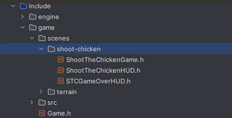

[![License][license-shield]][license-url]
[![Issues][issues-shield]][issues-url]
[![Forks][forks-shield]][forks-url]
[![Stars][stars-shield]][stars-url]
[![Pull Requests][pull-requests-shield]][pull-requests-url]
![Version][version-shield]
![Platform][platform-shield]
[![Code Style][code-style-shield]][code-style-url]
[![Documentation][documentation-shield]][documentation-url]
[![Build With][build-with-shield]][cmake-url]
[![Download][download-shield]][download-url]


<!-- PROJECT LOGO -->
<br />
<div align="center">
  <a href="https://github.com/othneildrew/Best-README-Template">
    
  </a>

<h3 align="center">GLESC Game Engine</h3>

  <p align="center">
    A c++ game engine using OpenGL and SDL2 based on ECS architecture.
    <br />
    <br />
    <a href="https://github.com/othneildrew/Best-README-Template"><strong>Read the documentation »</strong></a>
    <br />
    <br />
    <a href="https://github.com/othneildrew/Best-README-Template">View Demo</a>
    ·
    <a href="https://github.com/othneildrew/Best-README-Template/issues/new?labels=bug&template=bug-report---.md">Report Bug</a>
    ·
    <a href="https://github.com/othneildrew/Best-README-Template/issues/new?labels=enhancement&template=feature-request---.md">Request Feature</a>
  </p>
</div>


<!-- TABLE OF CONTENTS -->
<details>
  <summary>Table of Contents</summary>
  <ol>
    <li>
      <a href="#about-the-project">About The Project</a>
      <ul>
        <li><a href="#built-with">Built With</a></li>
      </ul>
    </li>
    <li>
      <a href="#getting-started">Getting Started</a>
      <ul>
        <li><a href="#prerequisites">Prerequisites</a></li>
        <li><a href="#installation">Installation</a></li>
      </ul>
    </li>
    <li><a href="#usage">Usage</a></li>
    <li><a href="#roadmap">Roadmap</a></li>
    <li><a href="#contributing">Contributing</a></li>
    <li><a href="#license">License</a></li>
    <li><a href="#contact">Contact</a></li>
    <li><a href="#acknowledgments">Acknowledgments</a></li>
  </ol>
</details>


<!-- ABOUT THE PROJECT -->

## About The Project

[](https://github.com/valydumitru01/GLESC)

<p>GLESC is a game engine implemented in C++ using OpenGL and SDL2. It is a final degree project for the Bachelor's 
Degree in Computer Engineering at the University of Oviedo. It's development lasted 1 year and a half of 
full-time work of a single person - <a href="#Contact">me</a>. <br>
The engine allows 3D rendering, shaders, physics, collisions, inputs and audio while also taking advantage of
ECS architecture (good cacheing).</p>

The project was developed with some principles in mind:

* **Modularity or Separation of Concerns (SoC)**: The engine is divided into modules, each one with a specific purpose. This allows for easy maintenance and scalability.
* **Performance**: The engine is designed to be as fast as possible. It uses ECS architecture, which is cache-friendly.
* **DRY**: The engine is designed to be as pretty DRY, but sometimes there is code repetition and it is not as DRY as it should be. This is because of the lack of time and experience of the developer. And sometimes for readability reasons.
* **KISS**: The engine is designed to be as simple as possible. This does not mean it is simple. It means that it is not more complex than it needs to be. Unfortunately, by definition, a game engine is a complex piece of software.
* **SOLID**: The engine is designed to be as SOLID as possible. This means that the code is easy to maintain and extend. It takes advantage of c++'s OOP and polymorphism to improve SOLID principles.
* **Documentation**: The engine is well documented, as it is a requirement for the assignment of the degree project.

> **Note**: It's important to take into consideration the huge constraints of the project:
> * The lack of experience of the developer
> * The lack of time and the time restrictions
> * The lack of resources (hardware and software)
> * The lack of knowledge of the developer (therefore a lot of time was spent learning).
>
> This project is not perfect and has some ugly workarounds, some poor design decisions, some bugs, and some performance
> issues. But it has also some great design decisions, some great code, and some great performance that took a lot of
> time and effort to achieve. 
> 
> _It should not be taken as a reference for a game engine, but as a learning experience_.

### Built With

<!-- Built with shields -->

- [![C++][cpp-shield]][cpp-url]
- [![CMake][CMake-shield]][CMake-url]
- [![OpenGL][OpenGL-shield]][OpenGL-url]
- [![SDL2][SDL2-shield]][SDL2-url]
- [![GLEW][GLEW-shield]][GLEW-url]
- [![ImGui][ImGui-shield]][ImGui-url]
- [![Mingw][Mingw-shield]][Mingw-url]
- [![Boost][Boost-shield]][Boost-url]

<p align="right">(<a href="#readme-top">back to top</a>)</p>

<!-- GETTING STARTED -->

## Getting Started

The following instructions will help you get a copy of the project up and running on your local machine for development
and testing purposes.

### Prerequisites

Here is a list of things you need to use the software and how to install them.
- #### Boost
  Boost is a set of libraries for the C++ programming language that provides support for tasks and structures such as
  linear algebra, pseudorandom number generation, multithreading, image processing, regular expressions, and unit testing.
  It contains over eighty individual libraries.

  It is used several times in the project, and can be used for more things if needed.

  > [**How to download and install**][Boost-tutorial]
  >
  > [**Wiki for more information**][Boost-wiki]
  >
  > [**Download link**][Boost-download]
  

- #### CLion (Optional but highly recommended)
  In order to compile and edit the code CLion has been used. It facilitates all the tools needed for the project, such
  as CMake, ninja, mingw, the compiler, and the debugger. It is not necessary to use CLion, but it is highly
  recommended.

  > [**Download link**][CLion-download]
  > 
  > [**Wiki for more information**][CLion-wiki]

- #### MinGW/GNU Compiler Collection (GCC)

  In order to execute our code, we will require GNU utilities. This contains numerous compilers for various languages (
  e.g. Fortran, C++ etc.) classified as the **GNU Compiler Collection (GCC)**, and their respective debuggers.


  MinGW includes a port of the **GNU Compiler Collection (GCC)**, GNU Binutils for Windows (assembler, linker, archive
  manager), a set of freely distributable Windows specific header files and static import libraries which enable the use
  of the Windows API, a Windows native build of the GNU Project's GNU Debugger, and miscellaneous utilities.

  > [**Download link (Installer)**]([Mingw-download-installer])
  >
  > _**IMPORTANT:** MUST SELECT x86_64 (which is 64 bits) **NOT** i686 (which is 32 bits)_
  >
  > In case the installer doesn't work (which is likely):
  > 
  > [**Download link (folder with 64 bits version)**]([Mingw-download-folder])
  > 
  > _**HOW TO INSTALL:**_
  > - Unzip the folder, copy it somewhere logical (for example `C:/MinGW` or `C:/Program Files/MinGW`).
  > - Add to the path of the Environment Variables the bin folder.<br><br>
  > 
  >
  > [**MinGW wiki for more information**]([Mingw-wiki])

- #### **CMake**
  CMake is an open-source, cross-platform family of tools designed to build, test, and package software. CMake is used to
  control the software compilation process using simple platform and compiler-independent configuration files, and
  generate native makefiles and workspaces that can be used in the compiler environment of your choice.

  > [**Download link**]([CMake-download])
  > 
  > [**Wiki for more information**]([CMake-wiki])


  

### Installation

Here is a step by step guide on how to install the project.


#### Installing with CLion

1. Clone the repo
   ```sh
   git clone https://github.com/valydumitru01/GLESC.git
    ```
2. Open the project with CLion
3. Prepare the project dependencies with CLion or your preferred IDE
4. Build the project with CMake
5. Run the project
<p align="right">(<a href="#readme-top">back to top</a>)</p>


<!-- USAGE EXAMPLES -->
## Usage

The following section is dedicated to explaining how to use the engine. I will be trying to examplify how to create a videogame using the engine using the current implemented game (Shoot the chicken).

### Creating a new game
Actually, the `Game` class only use is to handle the scenes. So you don't really need to touch the `Game` class more than just insert the scenes you need.
**How to register a scene:**
```cpp
void Game::init() {
    registerScene<Default>(Default::getSceneName());
    registerScene<TerrainGeneratorGame>(TerrainGeneratorGame::getSceneName());
    registerScene<ShootTheChickenGame>(ShootTheChickenGame::getSceneName());
    sceneManager.switchScene(ShootTheChickenGame::getSceneName());
}
```
To create a game you need to create a scene. This is done by creating a new class that inherits from the `Scene` class and then registering it in the `Game` class.
You can see an example of this in the `ShootTheChickenGame` class. 



**Example of a scene class:**
```cpp
class ShootTheChickenGame : public GLESC::Scene::Scene {
public:
    SCENE_DEFINITION(ShootTheChickenGame)
    ...
};
```

Once you have your scene defined and registered, you can start customizing it. You can add entities, components, systems, etc. The next sections will explain how to take advantage of all the GLESC engine features.

#### Creating an entity
Entities are the main objects in the engine. They are "containers" for components. 


**Example of entity creation:** (Extracted from ShootTheChickenGame, how chickens are created)
```cpp
void ShootTheChickenGame::generateChickenEntities() {
    int numChickens = 10;
    chickens.clear();
    for (int i = 0; i < numChickens; i++) {
        Transform::Position position = generateChickenPosition();
        ECS::Entity chicken = createEntity("chicken", {EntityType::Instance});
        chicken.addComponent<ECS::TransformComponent>();
        chicken.addComponent<ECS::RenderComponent>();
        chicken.addComponent<ECS::PhysicsComponent>();
        chicken.addComponent<ECS::CollisionComponent>();
        auto& transform = chicken.getComponent<ECS::TransformComponent>().transform;
        chicken.getComponent<ECS::TransformComponent>().transform.setPosition({position});
        chicken.getComponent<ECS::RenderComponent>().copyMesh(chickenMesh);
        chicken.getComponent<ECS::CollisionComponent>().collider.setBoundingVolume(
            chicken.getComponent<ECS::RenderComponent>().getMesh().getBoundingVolume());
        chicken.getComponent<ECS::PhysicsComponent>().physics.setAffectedByGravity(true);
        transform.setPosition({transform.getPosition().getX(), 100, transform.getPosition().getZ()});
        chicken.getComponent<ECS::PhysicsComponent>().physics.setMass(5);
        chickens.push_back(chicken.getID());
    }
}
```

To create an entity you need to call `createEntity("name", EntityMetadata)`. After that, you just attatch the components and modify them directly.

#### Components
Currently the engine has the following components:
- TransformComponen
- CollisionComponent
- InputComponent
- LightComponent
- PhysicsComponent
- RenderComponent
> **Note:** It also has these other components, but should not be used as the engine don't currently support more than one of each type, and they are hardcoded in the engine.
> - CameraComponent
> - SunComponent
> - FogComponent
Each one defines a different aspect of the entity. 

##### TransformComponent
The `TransformComponent` is used to define the position, rotation, and scale of the entity. It is used to define the entity's position in the world. 
##### CollisionComponent
The `CollisionComponent` stores the collider of the entity. You can define the bounding volume of the entity, and the engine will handle the collisions for you. You can also set the collision callback function to handle the collision events. And you can even set collision callback for a specific collider (a specific entity).
> Note: You can set the bounding volume of the collider to fit the mesh of the entity using: 
> ```cpp
> chicken.getComponent<ECS::CollisionComponent>().collider.setBoundingVolume(
>            chicken.getComponent<ECS::RenderComponent>().getMesh().getBoundingVolume());
> ```
#### PhysicsComponent
The `PhysicsComponent` is used to define the forces, acceleration, velocity, mass, etc of the entity. What really is in charge is to update the position of the entity based on the forces applied to it. And you can set the forces, acceleration, etc of the entity at any point.

#### RenderComponent
The `RenderComponent` stores the mesh and the material of the entity. You can build the mesh and set the material properties of the entity. The engine will handle the rendering for you. The mesh is a bit complicated so I will explain it in the next section.
##### Mesh
The mesh is a class that stores the vertices, normals, indices, and textures (not yet implemented) of the entity. 
###### Building a mesh

**Example of mesh creation:** (Extracted from ShootTheChickenGame, how the player mesh was created)
```cpp
    Render::ColorMesh playerGun = Render::MeshFactory::cuboid(0.5f, 0.5f, 5, Render::ColorRgb::Brown);
    Render::ColorMesh playerGunHandle = Render::MeshFactory::cuboid(0.5f, 0.5f, 3, Render::ColorRgb::DarkBrown);
    Transform::Transformer::translateMesh(playerGunHandle, {0, -0.5, 1.5});

    Render::ColorMesh playerHand = Render::MeshFactory::cuboid(0.5f, 0.5f, 5, Render::ColorRgb::ClearSkin);
    Transform::Transformer::rotateMesh(playerHand, {-25, -45, 0});
    Transform::Transformer::translateMesh(playerHand, {-0.3, -0.55, 1});

    playerGun.startBuilding();
    playerGun.attatchMesh(playerGunHandle);
    playerGun.attatchMesh(playerHand);
    playerGun.finishBuilding();

    // Rotate the gun to the left
    Transform::Transformer::rotateMesh(playerGun, {25, 25, 0});
    // Lift the gun to the player's hands
    Transform::Transformer::translateMesh(playerGun, {1.3, -1.5, -3});
    playerMesh.startBuilding();
    playerMesh.attatchMesh(playerGun);
    playerMesh.finishBuilding();

```

To build a mesh you need to use the `MeshFactory` class to create basic shapes (or building blocks). Then you can use the `Transformer` class to translate or rotate the mesh. Finally, you can attach the meshes to each other to create a more complex mesh.
<p align="right">(<a href="#readme-top">back to top</a>)</p>


<!-- ROADMAP -->
## Roadmap

- [x] Implement CMake builder
- [x] Add graphic api abstraction layer
  - [ ] Add Vulkan support
  - [ ] Add DirectX support
  - [ ] Add Metal support
  - [ ] Add OpenGL ES support
  - [x] Add OpenGL support
  - [ ] Add WebGL support
- [x] Create window abstraction
- [x] Create custom math implementation
  - [x] Create vector class
  - [x] Create matrix class
  - [x] Create geometry
    - [x] Create line class
    - [x] Create polyhedron class
    - [x] Create plane class
- [x] Add custom ECS architecture 
- [x] Add renderer
  - [x] Add shaders
    - [x] Add reflections
    - [x] Add ambient diffusion
    - [x] Add sun diffusion
    - [x] Add point light diffusion
    - [ ] Add spot light diffusion
    - [ ] Add shadows
  - [ ] Add post-processing
  - [x] Add skybox
  - [ ] Add textures
- [x] Add physics
  - [x] Forces, acceleration, velocity, etc
  - [x] Rigid body physics
  - [ ] Ragdoll physics
  - [ ] Soft body physics
  - [ ] Fluid dynamics
  - [ ] Cloth physics
- [x] Add HUD window system (using imgui)
- [x] Add collisions
  - [x] Add AABB
  - [ ] Add convex colliders
  - [x] Add OBB with SAT
  - [ ] Add GJK for convex colliders
  - [ ] Add quadtree or octree for broad-phase
- [x] Add inputs
- [x] Add sounds
- [x] Add scene management (currently is hardcoded)
  - [ ] Add scene serialization
  - [ ] Add scene deserialization
  - [ ] Add scene loading
  - [ ] Add scene saving
  - [ ] Add scene editor
- [x] Add in-game debug 
  - [x] Add in-game debug hud
    - [x] Console
    - [x] Entity list
    - [x] Entity inspector
    - [x] General debug info (fps, render calls, etc)
  - [ ] Add collider rendering
  - [ ] Add bounding volume rendering
  - [ ] Add normals rendering
  - [ ] Add profiler
  - [ ] Add memory debugger
  - [ ] Add memory leak detector
- [x] Create tests
  - [x] Unit tests
    - [x] Math
    - [x] ECS
    - [ ] Physics
    - [ ] Collisions
    - [x] Window
    - [ ] Renderer
  - [x] Integration tests
    - [x] ECS


See the [open issues](https://github.com/othneildrew/Best-README-Template/issues) for a full list of proposed features (and known issues).

<p align="right">(<a href="#readme-top">back to top</a>)</p>


<!-- CONTRIBUTING -->
## Contributing

For now, I am the sole contributor to this project, as this is a final degree project. One of the requirements of the final degree project is that it must be done by a single person. However, if you want to contribute to the project, contact me and we can discuss it once the project has been presented.

> Note: The current list of contributors of github is not accurate. No one has contributed to this project yet. 
The reason there are contributors is because I have reused the repository from another project in which I have collaborated with other people. Nothing serious, but I wanted to clarify it.

<p align="right">(<a href="#readme-top">back to top</a>)</p>


<!-- LICENSE -->
## License

Distributed under the MIT License. See [`LICENSE.txt`][license-url] for more information.

<p align="right">(<a href="#readme-top">back to top</a>)</p>


<!-- CONTACT -->
## Contact <a name="Contact"></a>

Valentin Dumitru - [Twitter: @valentindmtr115](https://twitter.com/valentindmtr115) - email: valentindmtr115@gmail.com

Project Link: https://github.com/valydumitru01/GLESC/

<p align="right">(<a href="#readme-top">back to top</a>)</p>


<!-- ACKNOWLEDGMENTS -->
## Acknowledgments

I would like to thank the following people and resources for helping me with this project:

* [The Cherno - OpenGL series](https://www.youtube.com/watch?v=45MIykWJ-C4&list=PLZQftyCk7_SdoVexSmwy_tBgs7P0b97yD)
* [Professor Keenan Crane - Computer Graphics course (CMU 15-462/662)](https://www.youtube.com/watch?v=W6yEALqsD7k&list=PL9_jI1bdZmz2emSh0UQ5iOdT2xRHFHL7E)
* [Austin Morlam - What is an ECS](https://austinmorlan.com/posts/entity_component_system/#what-is-an-ecs)
* [Joey de Vries - LearnOpenGL](https://learnopengl.com/)
* [Jason Gregory - Game Engine Architecture](https://www.amazon.com/Game-Engine-Architecture-Jason-Gregory/dp/1568814135)
* [Bob Nystrom - Game Programming Patterns](https://gameprogrammingpatterns.com/)
* [Google stylesheet](https://google.github.io/styleguide/cppguide.html)
* [CPP Core Guidelines](https://isocpp.github.io/CppCoreGuidelines/CppCoreGuidelines)
* [CPP best practices](https://lefticus.gitbooks.io/cpp-best-practices/content/#)
* And [me][My-Portfolio]! (For being able to handle all the stress, hardwork and dedication needed to finish this project)


<p align="right">(<a href="#readme-top">back to top</a>)</p>

<!-- MARKDOWN LINKS & IMAGES -->
<!-- https://www.markdownguide.org/basic-syntax/#reference-style-links -->

[build-with-shield]: https://img.shields.io/badge/build_with-CMake-064F8C?style=for-the-badge&logo=cmake

<!-- Build with shields -->

[cpp-shield]: https://img.shields.io/badge/C%2B%2B-00599C?style=for-the-badge&logo=c%2B%2B&logoColor=white
[CMake-shield]: https://img.shields.io/badge/CMake-064F8C?style=for-the-badge&logo=cmake&logoColor=white
[OpenGL-shield]: https://img.shields.io/badge/OpenGL-5586A4?style=for-the-badge&logo=opengl&logoColor=white
[SDL2-shield]: https://img.shields.io/badge/SDL2-FFCC00?style=for-the-badge&logo=sdl&logoColor=white
[GLEW-shield]: https://img.shields.io/badge/GLEW-FFCC00?style=for-the-badge&logo=glew&logoColor=white
[ImGui-shield]: https://img.shields.io/badge/ImGui-FF6F61?style=for-the-badge&logo=imgui&logoColor=white
[Mingw-shield]: https://img.shields.io/badge/Mingw-FF6F61?style=for-the-badge&logo=mingw&logoColor=white
[Boost-shield]: https://img.shields.io/badge/Boost-FF6F61?style=for-the-badge&logo=boost&logoColor=white

<!-- Tools urls -->

[cpp-url]: https://cplusplus.com/
[CMake-url]: https://cmake.org/
[OpenGL-url]: https://www.opengl.org/
[SDL2-url]: https://www.libsdl.org/
[GLEW-url]: https://glew.sourceforge.net/
[GLM-url]: https://glm.g-truc.net/0.9.9/index.html
[ImGui-url]: https://github.com/ocornut/imgui/
[Mingw-url]: https://sourceforge.net/projects/mingw-w64/
[Boost-url]: https://www.boost.org/


<!-- Project's Github shields -->

[documentation-shield]: https://img.shields.io/badge/documentation-available-brightgreen?style=for-the-badge
[issues-shield]: https://img.shields.io/github/issues/valydumitru01/GLESC?style=for-the-badge
[forks-shield]: https://img.shields.io/github/forks/valydumitru01/GLESC?style=for-the-badge
[stars-shield]: https://img.shields.io/github/stars/valydumitru01/GLESC?style=for-the-badge
[pull-requests-shield]: https://img.shields.io/github/issues-pr/valydumitru01/GLESC?style=for-the-badge
[download-shield]: https://img.shields.io/badge/download-0.0.1-blue?style=for-the-badge


<!-- Project's Github urls -->

[issues-url]: https://github.com/valydumitru01/GLESC/issues/
[forks-url]: https://github.com/valydumitru01/GLESC/network/members/
[stars-url]: https://github.com/valydumitru01/GLESC/stargazers/
[pull-requests-url]: https://github.com/valydumitru01/GLESC/pulls/
[project-url]: https://github.com/valydumitru01/GLESC/
<!--[download-url] :-->

<!-- Dependencies download urls -->

[Mingw-download-installer]: https://sourceforge.net/projects/mingw-w64/files/Toolchains%20targetting%20Win32/Personal%20Builds/mingw-builds/installer/mingw-w64-install.exe/download
[Mingw-download-folder]:https://sourceforge.net/projects/mingw-w64/files/Toolchains%20targetting%20Win64/Personal%20Builds/mingw-builds/8.1.0/threads-win32/seh/x86_64-8.1.0-release-win32-seh-rt_v6-rev0.7z/download
[CLion-download]: https://www.jetbrains.com/clion/download/
[Boost-download]: https://www.boost.org/users/download/
[CMake-download]: https://cmake.org/download/

<!-- Dependencies wiki urls -->

[Mingw-wiki]: http://mingw.org/
[CLion-wiki]: https://www.jetbrains.com/clion/
[Boost-wiki]: https://www.boost.org/
[CMake-wiki]: https://cmake.org/

<!--Installation tutorials -->
[Boost-tutorial]: https://www.boost.io/doc/user-guide/getting-started.html#:~:text=Download%20Boost%201%20Navigate%20to%20https%3A%2F%2Fwww.boost.org%2Fusers%2Fdownload%2F%20and%20under,compressed%20file%20and%20extract%20it%20to%20a%20folder.


<!-- My personal Urls -->
[My-Portfolio]: https://valydumitru01.github.io/ValentinDumitrusPortfolio/
[My-Twitter]: https://twitter.com/valentindmtr115
[My-LinkedIn]: https://www.linkedin.com/in/valentin-dumitru-a4703a211/
[My-Github]: https://github.com/valydumitru01

<!-- Misc shields -->

[game-engine-shield]: https://img.shields.io/badge/game_engine-C%2B%2B-00599C?style=for-the-badge&logo=game-engine&logoColor=white
[license-shield]: https://img.shields.io/badge/license-MIT-blue?style=for-the-badge
[version-shield]: https://img.shields.io/badge/version-0.0.1-blue?style=for-the-badge
[platform-shield]: https://img.shields.io/badge/platform-Windows-informational?style=for-the-badge
[code-style-shield]: https://img.shields.io/badge/code_style-Custom-AB47BC?style=for-the-badge

<!-- Misc variables -->

[license-url]: LICENSE.txt
[project-version]: 0.0.1
[code-style-url]: doc/CODE_STYLE.md
[documentation-url]: doc/TFG_GLESC_Documentation.pdf
[GLESC_logo]: doc/images/GLESC_logo.png