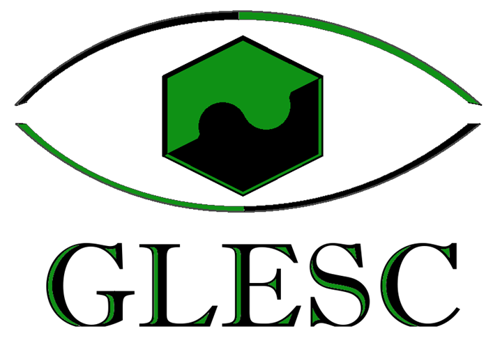
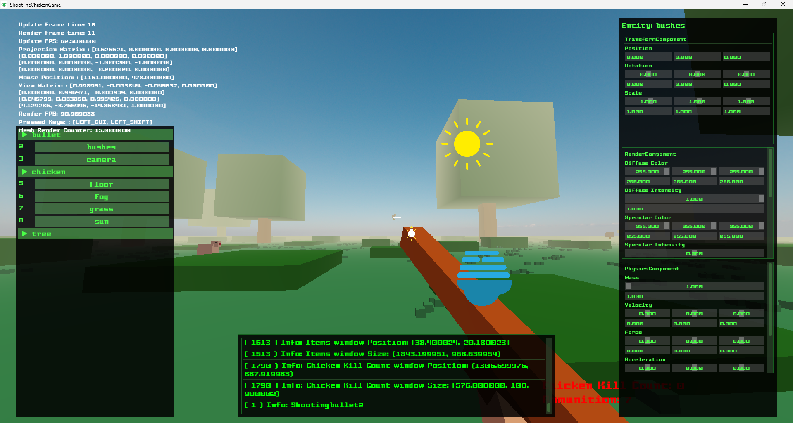
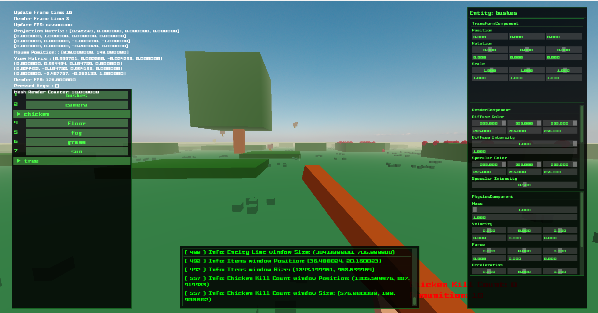

[![License][license-shield]][license-url] [![Issues][issues-shield]][issues-url]
[![Forks][forks-shield]][forks-url] [![Stars][stars-shield]][stars-url]
[![Pull Requests][pull-requests-shield]][pull-requests-url]
![Version][version-shield] ![Platform][platform-shield]
[![Code Style][code-style-shield]][code-style-url]
[![Documentation][documentation-shield]][documentation-url]
[![Build With][build-with-shield]][CMake-url]

**Game example download links:**
- [![Download][download-terrain-generator-shield-release]][download-terrain-generator-release-url]
- [![Download][download-terrain-generator-shield-debug]][download-terrain-generator-debug-url]
- [![Download][download-shoot-the-chicken-release-shield]][download-shoot-the-chicken-release-url]
- [![Download][download-shoot-the-chicken-debug-shield]][download-shoot-the-chicken-debug-url]
<a id="readme-top"></a>

<!-- PROJECT LOGO -->
<br />
<div align="center">
  <a href="https://github.com/othneildrew/Best-README-Template">
    
  </a>

<h3 align="center">GLESC Game Engine</h3>

  <p style="text-align: center;">
    A c++ game engine using OpenGL and SDL2 based on ECS architecture.
    <br />
    <br />
        <a href="https://valydumitru01.github.io/GLESC/doc/doxy/generated-doxy/html/index.html">
            <strong>Read the Doxygen documentation »</strong>
        </a>
    <br />
    <br />
    <a href="https://github.com/othneildrew/Best-README-Template">View Demo</a>
    ·
    <a href="https://github.com/othneildrew/Best-README-Template/issues/new?labels=bug&template=bug-report---.md">
Report Bug
</a>
    ·
    <a 
href="https://github.com/othneildrew/Best-README-Template/issues/new?labels=enhancement&template=feature-request---.md">
Request Feature</a>
  </p>
</div>

**Table of Contents**
<!-- TOC -->
  * [About The Project](#about-the-project)
    * [Built With](#built-with)
  * [Getting Started](#getting-started)
    * [Prerequisites](#prerequisites)
    * [Installation](#installation)
      * [Installing with CLion](#installing-with-clion)
  * [Usage](#usage)
    * [Creating a new game (or scene)](#creating-a-new-game-or-scene)
      * [Creating an entity](#creating-an-entity)
      * [Components](#components)
        * [TransformComponent](#transformcomponent)
        * [CollisionComponent](#collisioncomponent)
        * [PhysicsComponent](#physicscomponent)
        * [RenderComponent](#rendercomponent)
          * [Mesh](#mesh)
          * [Materials](#materials)
        * [LightComponent](#lightcomponent)
        * [SunComponent](#suncomponent)
        * [CameraComponent](#cameracomponent)
        * [FogComponent](#fogcomponent)
      * [Systems](#systems)
      * [HUD](#hud)
      * [Debug](#debug)
      * [Sounds](#sounds)
  * [Roadmap](#roadmap)
  * [Contributing](#contributing)
  * [License](#license)
  * [Contact](#contact)
  * [Acknowledgments](#acknowledgments)
<!-- TOC -->


<!-- ABOUT THE PROJECT -->

## About The Project

[][project-url]

GLESC is a game engine implemented in C++ using OpenGL and SDL2. It is a final degree project for the Bachelor's
Degree in Computer Engineering at the University of Oviedo. It's development lasted 1 year and a half of
full-time work of a single person - <a href="#contact">me</a>. <br>
The engine allows 3D rendering, shaders, physics, collisions, inputs and audio while also taking advantage of
ECS architecture (good caching).

The project was developed with some principles in mind:

* **Modularity or Separation of Concerns (SoC)**: The engine is divided into modules, each one with a specific purpose.
  This allows for easy maintenance and scalability.
* **Performance**: The engine is designed to be as fast as possible. It uses ECS architecture, which is cache-friendly.
* **DRY**: The engine is designed to be as pretty DRY, but sometimes there is code repetition, and it is not as DRY as it
  should be. This is because of the lack of time and experience of the developer. And sometimes for readability reasons.
* **KISS**: The engine is designed to be as simple as possible. This does not mean it is simple. It means that it is not
  more complex than it needs to be. Unfortunately, by definition, a game engine is a complex piece of software.
* **SOLID**: The engine is designed to be as SOLID as possible. This means that the code is easy to maintain and extend.
  It takes advantage of c++'s OOP and polymorphism to improve SOLID principles.
* **Documentation**: The engine is well documented, as it is a requirement for the assignment of the degree project.

> **Note**: It's important to take into consideration the huge constraints of the project:
> * The lack of experience of the developer
> * The lack of time and the time restrictions
> * The lack of resources (hardware and software)
> * The lack of knowledge of the developer (therefore a lot of time was spent learning).
>
> This project is not perfect and has some ugly workarounds, some poor design decisions, some bugs, and some performance
> issues. But it has also some great design decisions, some great code, and some great performance that took a lot of
> time and effort to achieve.
>
> _It should not be taken as a reference for a game engine, but as a learning experience_.

### Built With

<!-- Built with shields -->

- [![C++][cpp-shield]][cpp-url]
- [![CMake][CMake-shield]][CMake-url]
- [![OpenGL][OpenGL-shield]][OpenGL-url]
- [![SDL2][SDL2-shield]][SDL2-url]
- [![GLEW][GLEW-shield]][GLEW-url]
- [![ImGui][ImGui-shield]][ImGui-url]
- [![Mingw][Mingw-shield]][Mingw-url]
- [![Boost][Boost-shield]][Boost-url]

<p align="right">(<a href="#rea1dme-top">back to top</a>)</p>

<!-- GETTING STARTED -->

## Getting Started

The following instructions will help you get a copy of the project up and running on your local machine for development
and testing purposes.

### Prerequisites

Here is a list of things you need to use the software and how to install them.

- #### Boost
  Boost is a set of libraries for the C++ programming language that provides support for tasks and structures such as
  linear algebra, pseudorandom number generation, multithreading, image processing, regular expressions, and unit
  testing.
  It contains over eighty individual libraries.

  It is used several times in the project, and can be used for more things if needed.

  > [**How to download and install**][Boost-tutorial]
  >
  > [**Wiki for more information**][Boost-wiki]
  >
  > [**Download link**][Boost-download]


- #### CLion (Optional but highly recommended)
  In order to compile and edit the code CLion has been used. It facilitates all the tools needed for the project, such
  as CMake, ninja, mingw, the compiler, and the debugger. It is not necessary to use CLion, but it is highly
  recommended.

  > [**Download link**][CLion-download]
  >
  > [**Wiki for more information**][CLion-wiki]

- #### MinGW/GNU Compiler Collection (GCC)

  In order to execute our code, we will require GNU utilities. This contains numerous compilers for various languages (
  e.g. Fortran, C++ etc.) classified as the **GNU Compiler Collection (GCC)**, and their respective debuggers.

MinGW includes a port of the **GNU Compiler Collection (GCC)**, GNU Binutils for Windows (assembler, linker, archive
manager), a set of freely distributable Windows specific header files and static import libraries which enable the use
of the Windows API, a Windows native build of the GNU Project's GNU Debugger, and miscellaneous utilities.

> [**Download link (Installer)**][Mingw-download-installer]
>
> _**IMPORTANT:** MUST SELECT x86_64 (which is 64 bits) **NOT** i686 (which is 32 bits)_
>
> In case the installer doesn't work (which is likely):
>
> [**Download link (folder with 64 bits version)**][Mingw-download-folder]
>
> _**HOW TO INSTALL:**_
> - Unzip the folder, copy it somewhere logical (for example `C:/MinGW` or `C:/Program Files/MinGW`).
> - Add to the path of the Environment Variables the bin folder.<br><br>
>
>
> [**MinGW wiki for more information**][Mingw-wiki]

- #### **CMake**
  CMake is an open-source, cross-platform family of tools designed to build, test, and package software. CMake is used
  to
  control the software compilation process using simple platform and compiler-independent configuration files, and
  generate native makefiles and workspaces that can be used in the compiler environment of your choice.

  > [**Download link**][CMake-download]
  >
  > [**Wiki for more information**][CMake-wiki]

### Installation

Here is a step-by-step guide on how to install the project.

#### Installing with CLion

1. Clone the repo
   ```sh
   git clone https://github.com/valydumitru01/GLESC.git
    ```
2. Open the project with CLion
3. Prepare the project dependencies with CLion or your preferred IDE
4. Build the project with CMake
5. Run the project

<p align="right">(<a href="#readme-top">back to top</a>)</p>


<!-- USAGE EXAMPLES -->

## Usage

The following section is dedicated to explaining how to use the engine. I will be trying to exemplify how to create a
video-game using the engine using the current implemented game (Shoot the chicken).

> **Important Note:** This engine is hardcoded, there is absolutely no Data-Driven programming involved. This was a
> conscious choice given the constraints. So one big issue of using this engine is having to wait for all the compile
> times for each minor change.

> **Important Note 2:** There is heavy use of strings in the engine. This is because of the lack of time to implement a
> better system. And also, it's very useful for debugging and for UX. But it is not the best practice due to efficiency
> reasons. In a normal, data oriented engine, strings would be just data and would not be part of the compiled code or
> logic.

### Creating a new game (or scene)

Actually, the `Game` class only use is to handle the scenes. So you don't really need to touch the `Game` class more
than just insert the scenes you need.

To create a new scene you need to create a new class that inherits from the `Scene` class. You can see an example of
this in the `ShootTheChickenGame` class.
**How to register a scene:**

```cpp
void Game::init() {
    registerScene<Default>(Default::getSceneName());
    registerScene<TerrainGeneratorGame>(TerrainGeneratorGame::getSceneName());
    registerScene<ShootTheChickenGame>(ShootTheChickenGame::getSceneName());
    sceneManager.switchScene(ShootTheChickenGame::getSceneName());
}
```


**Example of a scene class:**

```cpp
class ShootTheChickenGame : public GLESC::Scene::Scene {
public:
    SCENE_DEFINITION(ShootTheChickenGame)
    ...
};
```

Once you have your scene defined and registered, you can start customizing it. You can add entities, components,
systems, etc. The next sections will explain how to take advantage of all the GLESC engine features.

#### Creating an entity

Entities are the main objects in the engine. They can seem like "containers" for components but in reality they are just
wrapped IDs. You create them with a name and a metadata. That name can then be retrieved to get the entity.  
You can only set the metadata of instance, this way the name of the entity gets automatically increased by one, so you
don't have to worry about the name of the entity. It has no other purpose than that.

**Example of entity creation:** _(Extracted from ShootTheChickenGame, how chickens are created)_

```cpp
void ShootTheChickenGame::generateChickenEntities() {
    int numChickens = 10;
    chickens.clear();
    for (int i = 0; i < numChickens; i++) {
        Transform::Position position = generateChickenPosition();
        ECS::Entity chicken = createEntity("chicken", {EntityType::Instance});
        chicken.addComponent<ECS::TransformComponent>();
        chicken.addComponent<ECS::RenderComponent>();
        chicken.addComponent<ECS::PhysicsComponent>();
        chicken.addComponent<ECS::CollisionComponent>();
        auto& transform = chicken.getComponent<ECS::TransformComponent>().transform;
        chicken.getComponent<ECS::TransformComponent>().transform.setPosition({position});
        chicken.getComponent<ECS::RenderComponent>().copyMesh(chickenMesh);
        chicken.getComponent<ECS::CollisionComponent>().collider.setBoundingVolume(
            chicken.getComponent<ECS::RenderComponent>().getMesh().getBoundingVolume());
        chicken.getComponent<ECS::PhysicsComponent>().physics.setAffectedByGravity(true);
        transform.setPosition({transform.getPosition().getX(), 100, transform.getPosition().getZ()});
        chicken.getComponent<ECS::PhysicsComponent>().physics.setMass(5);
        chickens.push_back(chicken.getID());
    }
}


To create an entity you need to call `createEntity("name", EntityMetadata)`. After that, you just attach the components
 and modify them directly.
```

**Example of retrieving an entity:** _(Extracted from ShootTheChickenGame, how the player entity was retrieved)_

```cpp
    ECS::Entity player = getEntity("player");
```

To retrieve an entity you just need to call `getEntity("name")`. This will return the entity with that name.

#### Components

Currently, the engine has the following components:

- TransformComponent
- CollisionComponent
- InputComponent
- LightComponent
- PhysicsComponent
- RenderComponent

> **Note:** It also has these other components, but should not be used as the engine don't currently support more than
> one of each type, and they are hardcoded in the engine.
> - CameraComponent
> - SunComponent
> - FogComponent
    Each one defines a different aspect of the entity.

##### TransformComponent

The `TransformComponent` is used to define the position, rotation, and scale of the entity. It is used to define the
entity's position in the world.

##### CollisionComponent

The `CollisionComponent` stores the collider of the entity. You can define the bounding volume of the entity, and the
engine will handle the collisions for you. You can also set the collision callback function to handle the collision
events. And you can even set collision callback for a specific collider (a specific entity).
> Note: You can set the bounding volume of the collider to fit the mesh of the entity using:
> ```cpp
> chicken.getComponent<ECS::CollisionComponent>().collider.setBoundingVolume(
>            chicken.getComponent<ECS::RenderComponent>().getMesh().getBoundingVolume());
> ```

**Example of collision component creation:** _(Extracted from ShootTheChickenGame, how the bullet collision was
created)_

```cpp
bullet.addComponent<ECS::CollisionComponent>();
bullet.getComponent<ECS::CollisionComponent>().collider.setBoundingVolume(
    bullet.getComponent<ECS::RenderComponent>().getMesh().getBoundingVolume());
bullet.getComponent<ECS::CollisionComponent>().collider.setCollisionCallback(
    [bulletID, this](Physics::Collider& otherCollider) {
        collisionCallback(bulletID, otherCollider);
    });
```

##### PhysicsComponent

The `PhysicsComponent` is used to define the forces, acceleration, velocity, mass, etc. of the entity. What really is in
charge is to update the position of the entity based on the forces applied to it. And you can set the forces,
acceleration, etc. of the entity at any point.

##### RenderComponent

The `RenderComponent` stores the mesh and the material of the entity. You can build the mesh and set the material
properties of the entity. The engine will handle the rendering for you. The mesh is a bit complicated, so I will explain
it in the next section.

###### Mesh

The mesh is a class that stores the vertices, normals, indices, and textures (not yet implemented) of the entity.
**Building a mesh**

**Example of mesh creation:** _(Extracted from ShootTheChickenGame, how the player mesh was created)_

```cpp
Render::ColorMesh playerGun = Render::MeshFactory::cuboid(0.5f, 0.5f, 5, Render::ColorRgb::Brown);
Render::ColorMesh playerGunHandle = Render::MeshFactory::cuboid(0.5f, 0.5f, 3, Render::ColorRgb::DarkBrown);
Transform::Transformer::translateMesh(playerGunHandle, {0, -0.5, 1.5});

Render::ColorMesh playerHand = Render::MeshFactory::cuboid(0.5f, 0.5f, 5, Render::ColorRgb::ClearSkin);
Transform::Transformer::rotateMesh(playerHand, {-25, -45, 0});
Transform::Transformer::translateMesh(playerHand, {-0.3, -0.55, 1});

playerGun.startBuilding();
playerGun.attachMesh(playerGunHandle);
playerGun.attachMesh(playerHand);
playerGun.finishBuilding();

// Rotate the gun to the left
Transform::Transformer::rotateMesh(playerGun, {25, 25, 0});
// Lift the gun to the player's hands
Transform::Transformer::translateMesh(playerGun, {1.3, -1.5, -3});
playerMesh.startBuilding();
playerMesh.attachMesh(playerGun);
playerMesh.finishBuilding();

```

To build a mesh you need to use the `MeshFactory` class to create basic shapes (or building blocks). Then you can use
the `Transformer` class to translate or rotate the mesh. Finally, you can attach the meshes to each other to create a
more complex mesh.
> **Note:** Attaching meshes like this is a bit complicated and not user-friendly, but this is the only way to do it
> for now. Mesh loaders or builders are not yet implemented. As it was previously stated, there is no data-driven
> programming in the engine.

###### Materials

Materials are fairly easy to understand and use. Each render component has one material, and each material has a set of
function members that define the material properties.
**Material properties:**

```cpp
void setDiffuseColor(const ColorRgb& diffuseColor) { this->diffuseColor = diffuseColor; }
void setDiffuseIntensity(const float diffuseIntensity) { this->diffuseIntensity.set(diffuseIntensity); }
void setSpecularColor(const ColorRgb& specularColor) { this->specularColor = specularColor; }
void setSpecularIntensity(const float specularIntensity) { this->specularIntensity.set(specularIntensity); }
void setEmissionColor(const ColorRgb& emissionColor) { this->emissionColor = emissionColor; }
void setEmissionIntensity(const float emmissionIntensity) { this->emissionIntensity.set(emissionIntensity); }
void setShininess(const float shininess) { this->shininess.set(shininess); }
```	
> **Note:** Not all properties do something. Emission intensity and color do not work. The rest should work fine.
<p align="right">(<a href="#readme-top">back to top</a>)</p>

##### InputComponent
The `InputComponent` is used to define the inputs of the entity. It is quite intuitive and easy to use. 
You basically subscribe the entity to a key (with it's action) and define a callback function to handle the input event.
 You can also unsubscribe the entity from a key.

**Example of input component creation:** _(Extracted from ShootTheChickenGame, how the player input was created)_
```cpp
getCamera().getEntity().getComponent<ECS::InputComponent>().input.unsubscribeKey(
    {Input::Key::SPACE, Input::KeyAction::ONGOING_PRESSED});
getCamera().getEntity().getComponent<ECS::InputComponent>().input.unsubscribeKey(
    {Input::Key::LEFT_SHIFT, Input::KeyAction::ONGOING_PRESSED});
getCamera().getEntity().getComponent<ECS::InputComponent>().input.subscribeKey(
    {Input::Key::LEFT_CLICK, Input::KeyAction::ONCE_PRESSED}, shootBulletAction);
getCamera().getEntity().getComponent<ECS::InputComponent>().input.subscribeKey(
    {Input::Key::SPACE, Input::KeyAction::ONCE_PRESSED}, jumpAction);

getCamera().getEntity().getComponent<ECS::InputComponent>().input.subscribeKey(
    {Input::Key::R, Input::KeyAction::ONCE_PRESSED}, {
        [&]()-> void {
            if (getWindow<ShootTheChickenHUD>(statsWindow).getAmmunition() == 0) {
                switchScene<ShootTheChickenGame>();
            }
        }
    }
```

> **Note:** You will probably need to unsubscribe from the current keys of the camera entity. This is because the camera
> has a set of default behaviors that you might not want. You can also just make a new input component and replace the
> old
> one.

##### LightComponent

The `LightComponent` gives a point-light to the entity. The point light will be rendered at the position of the transform
of the entity. If the entity also has a mesh, the light will be rendered at the center of the mesh. So it would probably
not be seen. You can set the color, intensity and radius of the light.

**Example of light component creation:** _(Extracted from ShootTheChickenGame, how the bullet light was created)_

```cpp
bullet.addComponent<ECS::LightComponent>();
bullet.getComponent<ECS::LightComponent>().light.setColor(Render::ColorRgb::Yellow);
```

And you can see, pretty simple.

##### SunComponent

As I noted previously, there is no need to use these components. But you do need to understand how to use them to change
the camera, sun and fog.

The sun component is used to define the sun diffuse and ambient diffuse.
**Example of sun component modification** _(Extracted from ShootTheChickenGame, how the sun was modified)_

```cpp
getEntity("sun").getComponent<ECS::SunComponent>().sun.setIntensity(0.4f);
getEntity("sun").getComponent<ECS::SunComponent>().sun.setColor({255, 255, 200});
getEntity("sun").getComponent<ECS::SunComponent>().sun.setDirection({-0.4, -1, -0.4});
getEntity("sun").getComponent<ECS::SunComponent>().globalAmbientLight.setIntensity(0.5);
getEntity("sun").getComponent<ECS::SunComponent>().globalAmbientLight.setColor({255, 180, 165});
```

> Those are predefined entities called "sun" and "fog" that you can modify.

##### CameraComponent

The camera component defines the camera properties such as the field of view, the near and far planes, and the aspect
ratio.
You can define them pretty easily.

**Example of camera component modification** _(Extracted from ShootTheChickenGame, how the camera was modified)_

```cpp
    getCamera().getEntity().getComponent<ECS::CameraComponent>().perspective.setFovDegrees(90);
```

> CameraComponent only contains perspective, there you get the attributes to modify.

##### FogComponent

The fog component defines the fog properties such as the color, the density, and the gradient.
It is also easy to modify.

**Example of fog component modification** _(Extracted from ShootTheChickenGame, how the fog was modified)_

```cpp
getEntity("fog").getComponent<ECS::FogComponent>().fog.setDensity(0.3);
getEntity("fog").getComponent<ECS::FogComponent>().fog.setColor({200, 200, 170});
getEntity("fog").getComponent<ECS::FogComponent>().fog.setEnd(60);
```

#### Systems

Systems are the classes that handle the logic of the game. They are in charge of updating the entities, handling the
collisions, updating the renderer, etc.
You don't need to understand the current systems, but you can create your own systems to handle the logic of your game.

Each system iterates over the entities that have the subscribed components for that system. So if you create a system
called `DeathSystem` and you subscribe the `CollisionComponent` and the `HealthComponent`, the system will iterate over
all the entities that have both components and will handle the logic of the death of the entity.

To create the system, you will need to inherit from the `System` class and implement the `update` function. The `update`
function is called every frame and is in charge of updating the entities.
You also need to modify the class `GLESC` inside the engine to register the system.
> **Note:** Ugly, I know, but I didn't have time to implement a system registration system.

**How to register a system:** _(Extracted from the engine, all the systems are registered here)_

```cpp
std::vector<std::unique_ptr<ECS::System>> Engine::createSystems() {
    std::vector<std::unique_ptr<ECS::System>> systems;
    systems.push_back(std::make_unique<ECS::RenderSystem>(renderer, ecs));
    systems.push_back(std::make_unique<ECS::TransformSystem>(ecs));
    // Physics system must update before the physics collision system
    systems.push_back(std::make_unique<ECS::PhysicsSystem>(physicsManager, ecs));
    systems.push_back(std::make_unique<ECS::PhysicsCollisionSystem>(physicsManager, collisionManager, ecs));
    systems.push_back(std::make_unique<ECS::InputSystem>(inputManager, ecs));
    systems.push_back(std::make_unique<ECS::CameraSystem>(renderer, windowManager, ecs));
    systems.push_back(std::make_unique<ECS::LightSystem>(ecs, renderer));
    systems.push_back(std::make_unique<ECS::SunSystem>(ecs, renderer));
    systems.push_back(std::make_unique<ECS::FogSystem>(renderer, ecs));
```

**Example of system creation:** _(Extracted from the engine, how the Transform system was created)_

```cpp
namespace GLESC::ECS {
    class TransformSystem : public System {
    public:
        explicit TransformSystem(ECSCoordinator& ecs);
        void update() override;
    };
} // namespace GLESC::ECS
```

**Example of system implementation:** _(Extracted from the engine, how the Transform system was implemented)_

```cpp
    TransformSystem::TransformSystem(ECSCoordinator& ecs) : System(ecs, "TransformSystem") {
        addComponentRequirement<TransformComponent>();
    }

    void TransformSystem::update() {
        for (auto& entity : getAssociatedEntities()) {
            auto& transform = getComponent<TransformComponent>(entity);
            transform.transform.setOwnerName(getEntityName(entity).c_str());
            Transform::Rotation rotation = transform.transform.getRotation();
            // Use of fmod to avoid floating point errors
            if (rotation.getX() < -360.0f)
                transform.transform.setRotation(Transform::RotationAxis::Pitch, 360.0f);
            if (rotation.getY() < -360.0f)
                transform.transform.setRotation(Transform::RotationAxis::Yaw, 360.0f);
            if (rotation.getZ() < -360.0f)
                transform.transform.setRotation(Transform::RotationAxis::Roll, 360.0f);

            if (rotation.getX() > 360.0f)
                transform.transform.setRotation(Transform::RotationAxis::Pitch, -360.0f);
            if (rotation.getY() > 360.0f)
                transform.transform.setRotation(Transform::RotationAxis::Yaw, -360.0f);
            if (rotation.getZ() > 360.0f)
                transform.transform.setRotation(Transform::RotationAxis::Roll, -360.0f);

        }
    }
```

> As you can see, you call addComponentRequirement to subscribe the component to the system, then all the entities that
> have the component will be updated by the system. To update the entities, you iterate over getAssociatedEntities() and
> update the entities.

#### HUD

The HUD is a system that is in charge of rendering the HUD of the game. It uses ImGUI, which is a very powerful library.
My implementation only facilitates the window separation and implements a layout for the HUD.

To create a HUD window you need to create a class that inherits from the `InGameWindow` and
override `void windowContent()` with the actual content of the window. The window content will be rendered by the engine
for you.

**Example of HUD window creation:** _(Extracted from the ShootTheChickenGame, how the stats window was created)_

```cpp
class ShootTheChickenHUD : public GLESC::InGameWindow{
public:
    ...
private:
    void windowContent(float timeOfFrame) override;
}; // class ChickenKillCountHUD
```

**Example of HUD window implementation:** _(Extracted from the ShootTheChickenGame, how the stats window was
implemented)_

```cpp
ShootTheChickenHUD::ShootTheChickenHUD() {
    this->setSizeFraction({0.3f, 0.1f});
    this->setTitle("Chicken Kill Count");
    isVisible = true;
    this->setLayoutPosition(GLESC::LayoutPos::BottomRight);
    this->setCenter(GLESC::WindowCenter::BottomRight);
    this->addFlag(ImGuiWindowFlags_NoResize);
    this->addFlag(ImGuiWindowFlags_NoMove);
    this->addFlag(ImGuiWindowFlags_NoCollapse);
    this->addFlag(ImGuiWindowFlags_NoTitleBar);
    this->addFlag(ImGuiWindowFlags_NoScrollbar);
    this->addFlag(ImGuiWindowFlags_NoSavedSettings);
    this->addFlag(ImGuiWindowFlags_NoBringToFrontOnFocus);
    this->addFlag(ImGuiWindowFlags_NoFocusOnAppearing);
    this->addFlag(ImGuiWindowFlags_NoInputs);
    this->addFlag(ImGuiWindowFlags_NoBackground);
}

void ShootTheChickenHUD::windowContent(float timeOfFrame) {
    ImGui::PushFont(HudLookAndFeel::get().getFont(HudLookAndFeel::get().getDefaultFont(), 30));
    // Push text color
    ImGui::PushStyleColor(ImGuiCol_Text, ImVec4(1.0f, 0.0f, 0.0f, 1.0f));  // Red color

    ImGui::Text("Chicken Kill Count: %d", chickenKillCount);
    ImGui::Text("Ammunition: %d", ammunition);
    ImGui::PopStyleColor();
    ImGui::PopFont();
}
```

It is necessary to add the ImGui flags to give the window the desired look. And also, it is necessary to set the custom
layout functions for proper window placement.
These are all the layout functions and enums:

```cpp
enum class LayoutPos {
    TopLeft,
    CenterLeft,
    BottomLeft,
    TopCenter,
    Center,
    BottomCenter,
    TopRight,
    CenterRight,
    BottomRight,
    Custom
};

enum class WindowCenter {
    TopLeft,
    CenterLeft,
    BottomLeft,
    TopCenter,
    Center,
    BottomCenter,
    TopRight,
    CenterRight,
    BottomRight
};
/**
  * @brief Set the max size of the window
  * @details If the window gets bigger this value, it will be clamped to this size
  */
void setMaxSize(ImVec2 size);
/**
  * @brief Set the min size of the window
  * @details If the window gets smaller this value, it will be clamped to this size
  */
void setMinSize(ImVec2 size);
/**
  * @brief Set the size of the window as a fraction of the screen size
  * @details The fraction is clamped between 0.0f and 1.0f
  */
void setSizeFraction(ImVec2 fraction);
/**
  * @brief Set the position of the window as a fraction of the screen size.
  * @details The fraction is clamped between 0.0f and 1.0f. The center of the window is set by the set center
  * function. The position will modify that center.
  */
void setPositionFraction(ImVec2 fraction);
/**
  * @brief Set the center of the window
  * @details The center is used to calculate the position of the window.
  */
void setCenter(WindowCenter center);
/**
  * @brief Set the layout position of the window
  * @details The layout position is used to calculate the position of the window.
  */
void setLayoutPosition(LayoutPos position);
```

#### Debug

During the execution of the game (in debug mode), you will see the debug HUD. It includes a console, a list of entities,
an inspector of the selected entity and a stats text window. These are very useful to edit and see what is the best way
to implement the game. _But as I said, it is hardcoded, so you can't change it, editing the entities mid-game is not
possible._

To be able to toggle the debug windows the camera entity is subscribed to the `LEFT CTRL` key. It is also subscribed by
default (even if not in debug) to the `1` key to toggle relative mouse.

**Debug window view:**


#### Sounds

The engine has a simple sound system that allows playing sounds and music. You can play music in a loop, switch it off
or change music. You can also play global sounds or even play sounds in a specific position, making them 3D sounds.
> **Note:** The engine uses the SDL2 library to play sounds.

> **Note 2:** The 3D sound was not enough tested, so it might not work as expected.

**Example of music and sound loading:** _(Extracted from the ShootTheChickenGame, how the sounds were loaded)_

```cpp
SoundPlayer::loadSong("Chicken_Blasters.mp3", "main_song");
SoundPlayer::loadSound("chicken_shot.mp3", "chicken_shot");
SoundPlayer::loadSound("shoot.mp3", "shoot");
SoundPlayer::loadSound("chicken_idle.mp3", "chicken_idle");
```

**Example of music and sound playing:** _(Extracted from the ShootTheChickenGame, how the sounds were played)_

```cpp
SoundPlayer::setMusic("main_song");
SoundPlayer::playMusic();
SoundPlayer::playSound("shoot");
```

To play a song you need first to set the music and then play it. To play a sound you just need to play it by name.

<!-- ROADMAP -->

## Roadmap

- [x] Implement CMake builder
- [x] Add graphic api abstraction layer
    - [ ] Add Vulkan support
    - [ ] Add DirectX support
    - [ ] Add Metal support
    - [ ] Add OpenGL ES support
    - [x] Add OpenGL support
    - [ ] Add WebGL support
- [x] Create window abstraction
- [x] Create custom math implementation
    - [x] Create vector class
    - [x] Create matrix class
    - [x] Create geometry
        - [x] Create line class
        - [x] Create polyhedron class
        - [x] Create plane class
- [x] Add custom ECS architecture
- [x] Add renderer
    - [x] Add mesh abstraction
        - [x] Add mesh class
        - [ ] Add assimp mesh loader
        - [ ] Add mesh builder
    - [x] Add shaders
        - [x] Add reflections
        - [x] Add ambient diffusion
        - [x] Add sun diffusion
        - [x] Add point light diffusion
        - [ ] Add spotlight diffusion
        - [ ] Add shadows
    - [ ] Add post-processing
    - [x] Add skybox
    - [ ] Add textures
- [x] Add physics
    - [x] Forces, acceleration, velocity, etc
    - [x] Rigid body physics
    - [ ] Rag-doll physics
    - [ ] Soft body physics
    - [ ] Fluid dynamics
    - [ ] Cloth physics
- [x] Add HUD window system (using imgui)
- [x] Add collisions
    - [x] Add AABB
    - [ ] Add OBB with SAT
    - [ ] Add convex colliders with SAT
    - [ ] Add GJK for convex colliders
    - [ ] Add quadtree or octree for broad-phase
    - [ ] Add mesh shape colliders
- [x] Add inputs
- [x] Add sounds
    - [x] Add music
    - [x] Add plain sounds
    - [x] Add 3D sounds
    - [x] Add sound loader
- [x] Add scene management (currently is hardcoded)
    - [ ] Add scene serialization
    - [ ] Add scene deserialization
    - [ ] Add scene loading
    - [ ] Add scene saving
    - [ ] Add scene editor
- [x] Add in-game debug
    - [x] Add in-game debug hud
        - [x] Console
        - [x] Entity list
        - [x] Entity inspector
        - [x] General debug info (fps, render calls, etc)
    - [ ] Add collider rendering
    - [ ] Add bounding volume rendering
    - [ ] Add normals rendering
    - [ ] Add profiler
    - [ ] Add memory debugger
    - [ ] Add memory leak detector
- [x] Create tests
    - [x] Unit tests
        - [x] Math
        - [x] ECS
        - [ ] Physics
        - [ ] Collisions
        - [x] Window
        - [ ] Renderer
    - [x] Integration tests
        - [x] ECS

See the [open issues](https://github.com/othneildrew/Best-README-Template/issues) for a full list of proposed features (
and known issues).

<p align="right">(<a href="#readme-top">back to top</a>)</p>


<!-- CONTRIBUTING -->

## Contributing

For now, I am the sole contributor to this project, as this is a final degree project. One of the requirements of the
final degree project is that it must be done by a single person. However, if you want to contribute to the project,
contact me, and we can discuss it once the project has been presented.

> Note: The current list of contributors of GitHub is not accurate. No one has contributed to this project yet.
> The reason there are contributors is that I have reused the repository from another project in which I have
> collaborated with other people. Nothing serious, but I wanted to clarify it.

<p align="right">(<a href="#readme-top">back to top</a>)</p>


<!-- LICENSE -->

## License

Distributed under the MIT License. See [`LICENSE.txt`][license-url] for more information.

<p align="right">(<a href="#readme-top">back to top</a>)</p>


<!-- CONTACT -->

## Contact

Valentin Dumitru - [Twitter: @valentindmtr115](https://twitter.com/valentindmtr115) - email: valentindmtr115@gmail.com

Project Link: https://github.com/valydumitru01/GLESC/

<p align="right">(<a href="#readme-top">back to top</a>)</p>


<!-- ACKNOWLEDGMENTS -->

## Acknowledgments

I would like to thank the following people and resources for helping me with this project:

* [The Cherno - OpenGL series](https://www.youtube.com/watch?v=45MIykWJ-C4&list=PLZQftyCk7_SdoVexSmwy_tBgs7P0b97yD)
* [Professor Keenan Crane - Computer Graphics course (CMU 15-462/662)](https://www.youtube.com/watch?v=W6yEALqsD7k&list=PL9_jI1bdZmz2emSh0UQ5iOdT2xRHFHL7E)
* [Austin Morlan - What is an ECS](https://austinmorlan.com/posts/entity_component_system/#what-is-an-ecs)
* [Joey de Vries - LearnOpenGL](https://learnopengl.com/)
* [Jason Gregory - Game Engine Architecture](https://www.amazon.com/Game-Engine-Architecture-Jason-Gregory/dp/1568814135)
* [Bob Nystrom - Game Programming Patterns](https://gameprogrammingpatterns.com/)
* [Google stylesheet](https://google.github.io/styleguide/cppguide.html)
* [CPP Core Guidelines](https://isocpp.github.io/CppCoreGuidelines/CppCoreGuidelines)
* [CPP best practices](https://lefticus.gitbooks.io/cpp-best-practices/content/#)
* [Best-README-Template](https://github.com/othneildrew/Best-README-Template/blob/master/README.md)
* And [me][My-Portfolio]! (For being able to handle all the stress, hard work and dedication needed to finish this
  project)

<p align="right">(<a href="#readme-top">back to top</a>)</p>

<!-- MARKDOWN LINKS & IMAGES -->
<!-- https://www.markdownguide.org/basic-syntax/#reference-style-links -->

[build-with-shield]: https://img.shields.io/badge/build_with-CMake-064F8C?style=for-the-badge&logo=cmake

<!-- Build with shields -->

[cpp-shield]: https://img.shields.io/badge/C%2B%2B-00599C?style=for-the-badge&logo=c%2B%2B&logoColor=white

[CMake-shield]: https://img.shields.io/badge/CMake-064F8C?style=for-the-badge&logo=cmake&logoColor=white

[OpenGL-shield]: https://img.shields.io/badge/OpenGL-5586A4?style=for-the-badge&logo=opengl&logoColor=white

[SDL2-shield]: https://img.shields.io/badge/SDL2-FFCC00?style=for-the-badge&logo=sdl&logoColor=white

[GLEW-shield]: https://img.shields.io/badge/GLEW-FFCC00?style=for-the-badge&logo=glew&logoColor=white

[ImGui-shield]: https://img.shields.io/badge/ImGui-FF6F61?style=for-the-badge&logo=imgui&logoColor=white

[Mingw-shield]: https://img.shields.io/badge/Mingw-FF6F61?style=for-the-badge&logo=mingw&logoColor=white

[Boost-shield]: https://img.shields.io/badge/Boost-FF6F61?style=for-the-badge&logo=boost&logoColor=white

<!-- Tools urls -->

[cpp-url]: https://cplusplus.com/

[CMake-url]: https://cmake.org/

[OpenGL-url]: https://www.opengl.org/

[SDL2-url]: https://www.libsdl.org/

[GLEW-url]: https://glew.sourceforge.net/

[GLM-url]: https://glm.g-truc.net/0.9.9/index.html

[ImGui-url]: https://github.com/ocornut/imgui/

[Mingw-url]: https://sourceforge.net/projects/mingw-w64/

[Boost-url]: https://www.boost.org/


<!-- Project's GitHub shields -->

[documentation-shield]: https://img.shields.io/badge/documentation-available-brightgreen?style=for-the-badge

[issues-shield]: https://img.shields.io/github/issues/valydumitru01/GLESC?style=for-the-badge

[forks-shield]: https://img.shields.io/github/forks/valydumitru01/GLESC?style=for-the-badge

[stars-shield]: https://img.shields.io/github/stars/valydumitru01/GLESC?style=for-the-badge

[pull-requests-shield]: https://img.shields.io/github/issues-pr/valydumitru01/GLESC?style=for-the-badge

[download-terrain-generator-shield-release]: https://img.shields.io/badge/download-terrain_generator-blue?style=for-the-badge
[download-terrain-generator-shield-debug]: https://img.shields.io/badge/download-terrain_generator_debug-blue?style=for-the-badge
[download-shoot-the-chicken-release-shield]: https://img.shields.io/badge/download-shoot_the_chicken-blue?style=for-the-badge
[download-shoot-the-chicken-debug-shield]: https://img.shields.io/badge/download-shoot_the_chicken_debug-blue?style=for-the-badge


<!-- Project's GitHub urls -->

[issues-url]: https://github.com/valydumitru01/GLESC/issues/

[forks-url]: https://github.com/valydumitru01/GLESC/network/members/

[stars-url]: https://github.com/valydumitru01/GLESC/stargazers/

[pull-requests-url]: https://github.com/valydumitru01/GLESC/pulls/

[project-url]: https://github.com/valydumitru01/GLESC/
[download-terrain-generator-release-url]: https://github.com/valydumitru01/GLESC/releases/download/terrain_generator/terrain_generator_release.rar
[download-terrain-generator-debug-url]: https://github.com/valydumitru01/GLESC/releases/download/terrain_generator_debug/terrain-generation-debug.zip
[download-shoot-the-chicken-release-url]: https://github.com/valydumitru01/GLESC/releases/download/game/release.zip
[download-shoot-the-chicken-debug-url]: https://github.com/valydumitru01/GLESC/releases/download/game_debug/debug.zip

<!-- Dependencies download urls -->

[Mingw-download-installer]: https://sourceforge.net/projects/mingw-w64/files/Toolchains%20targetting%20Win32/Personal%20Builds/mingw-builds/installer/mingw-w64-install.exe/download

[Mingw-download-folder]:https://sourceforge.net/projects/mingw-w64/files/Toolchains%20targetting%20Win64/Personal%20Builds/mingw-builds/8.1.0/threads-win32/seh/x86_64-8.1.0-release-win32-seh-rt_v6-rev0.7z/download

[CLion-download]: https://www.jetbrains.com/clion/download/

[Boost-download]: https://www.boost.org/users/download/

[CMake-download]: https://cmake.org/download/

<!-- Dependencies wiki urls -->

[Mingw-wiki]: http://mingw.org/

[CLion-wiki]: https://www.jetbrains.com/clion/

[Boost-wiki]: https://www.boost.org/

[CMake-wiki]: https://cmake.org/

<!--Installation tutorials -->

[Boost-tutorial]: https://www.boost.io/doc/user-guide/getting-started.html#:~:text=Download%20Boost%201%20Navigate%20to%20https%3A%2F%2Fwww.boost.org%2Fusers%2Fdownload%2F%20and%20under,compressed%20file%20and%20extract%20it%20to%20a%20folder.


<!-- My personal Urls -->

[My-Portfolio]: https://valydumitru01.github.io/ValentinDumitrusPortfolio/

[My-Twitter]: https://twitter.com/valentindmtr115

[My-LinkedIn]: https://www.linkedin.com/in/valentin-dumitru-a4703a211/

[My-Github]: https://github.com/valydumitru01

<!-- Misc shields -->

[game-engine-shield]: https://img.shields.io/badge/game_engine-C%2B%2B-00599C?style=for-the-badge&logo=game-engine&logoColor=white

[license-shield]: https://img.shields.io/badge/license-MIT-blue?style=for-the-badge

[version-shield]: https://img.shields.io/badge/version-0.0.1-blue?style=for-the-badge

[platform-shield]: https://img.shields.io/badge/platform-Windows-informational?style=for-the-badge

[code-style-shield]: https://img.shields.io/badge/code_style-Custom-AB47BC?style=for-the-badge

<!-- Misc variables -->

[GLESC_logo]: doc/images/GLESC_logo.png

[license-url]: LICENSE.txt

[project-version]: 0.0.1

[code-style-url]: doc/CODE_STYLE.md

[documentation-url]: doc/TFG_GLESC_Documentation.pdf

[GLESC_logo]: doc/images/GLESC_logo.png